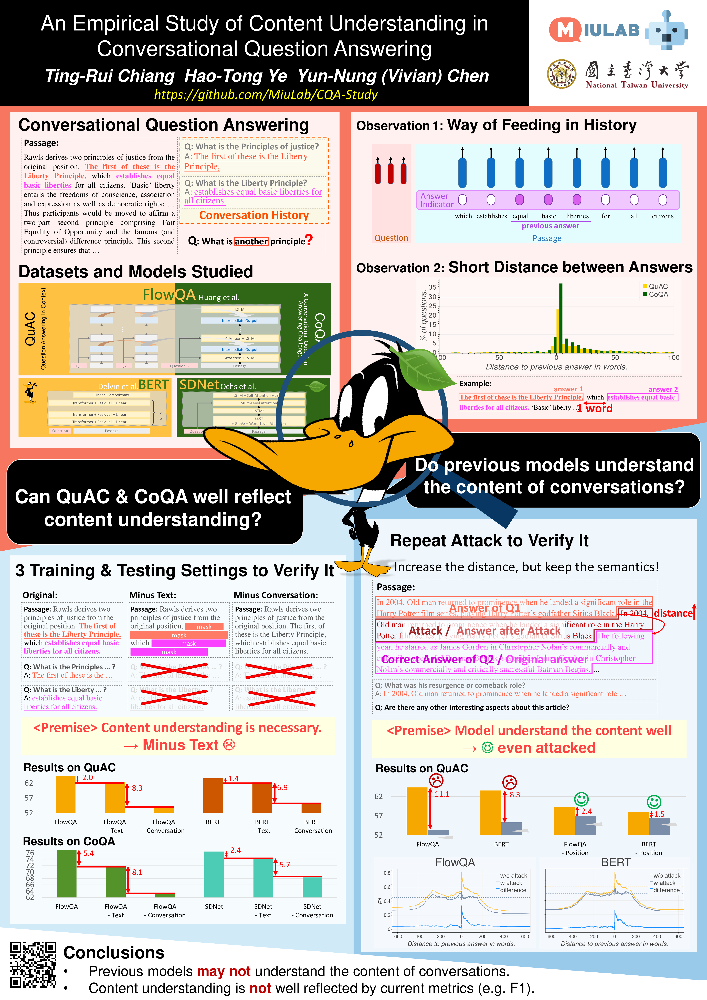

# An Empirical Study of Content Understanding in Conversational Question Answering

This is the repository for the AAAI 2020 paper [An Empirical Study of Content Understanding in Conversational Question Answering](https://arxiv.org/abs/1909.10743).

<p align="center">
  
</p>

## Get Dataset

To get the original CoQA/QuAC dataset and the attacked CoQA/QuAC dataset, run

```
bash get-dataset.sh
```

Then the attacked dataset can be found at

```
data/coqa/dev-attack.json
data/quac/val_v0.2-attack.json
```

Or one can simply use the scripts to apply the attacked dataset:

```
python3 scripts/attack_quac.py [input path] [output path]
python3 scripts/attack_coqa.py [input path] [output path]
```

## BERT Experiments

### Preprocess

```
cd BERT/src/
python make_dataset.py ../data/quac-bert
python make_dataset.py ../data/quac-bert-attack
```

### Train & Predict & Calculate Score

To train:

```
cd BERT/src/
bash train.sh
```

To predict:

```
cd BERT/src/
bash predict.sh
```

To calculate score:

```
cd BERT/src/
bash score.sh
```


## FlowQA Experiments

### Prepare GloVe

```
mkdir glove
wget http://nlp.stanford.edu/data/glove.840B.300d.zip -O glove/glove.840B.300d.zip
unzip glove/glove.840B.300d.zip -d glove
```


### Prepreocess

```
bash preprocess_QuAC.sh
bash preprocess_CoQA.sh
```

### Train & Predict & Calculate Score

To train:

```
cd FlowQA/
bash train_QuAC.sh
bash train_CoQA.sh
```

To predict:

```
cd FlowQA
bash predict-coqa.sh
bash predict-quac.sh
```


## SDNet Experiments

### Preparation

```
TBD
```


### Train & Predict & Calculate Score

To train:

```
TBD
```

To predict:

```
TBD
```

To calculate score:
```
TBD
```
